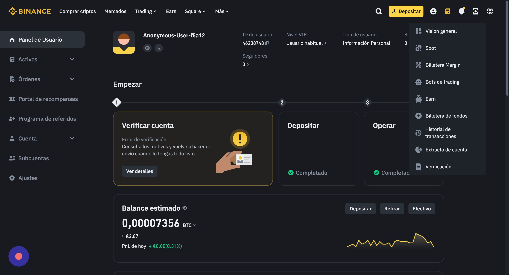

# 📊 Exportar tu Historial de Transacciones desde Binance a Investaxes.com

### 1. Inicia sesión en tu cuenta de Binance

* Accede a tu cuenta en [Binance](https://www.binance.com).

<figure><figcaption></figcaption></figure>

### 2. Accede al Historial de Transacciones

* Pasa el cursor sobre el icono de la **billetera** en la parte superior derecha de la página.
* Haz clic en **"Historial de transacciones"**.

<figure><figcaption></figcaption></figure>

### 3. Selecciona la opción de Exportar

* Ubica y haz clic en el **icono de exportación**, generalmente representado por una **flecha hacia abajo** o un **archivo**, dentro de la sección de historial.

<figure><figcaption></figcaption></figure>

### 4. Configura los parámetros de exportación

* **Rango de fechas**:\
  Elige el período que deseas exportar.\
  Ten en cuenta que Binance permite exportar datos de hasta **un año completo**.\
  Si necesitas datos de varios años, deberás realizar múltiples exportaciones.
* **Cuenta**:\
  Selecciona la cuenta  **Todo**.
* **Moneda**:\
  Elige **Todo**.

<figure><figcaption></figcaption></figure>

### 5. Genera el archivo

* Haz clic en el botón **"Generar"** para iniciar la creación del archivo CSV.
* Es posible que el proceso tarde algunos minutos, dependiendo del volumen de transacciones.

<figure><figcaption></figcaption></figure>

### 6. Descarga el archivo

* Una vez que el archivo esté listo, recibirás una notificación por correo electrónico o mensaje de texto.
* Vuelve a la ventana emergente de exportación y haz clic en **"Descargar"** junto al extracto generado.

<figure><figcaption></figcaption></figure>

> ⚠️ **Importante**:\
> El enlace de descarga del extracto **solo estará disponible durante 7 días**.\
> Asegúrate de descargarlo antes de que expire.
>
> Puede ser que se descargue un archivo .zip tendrás que descomprimirlo y quedarte con el .csv

### 7. Inicia sesión en tu cuenta de investaxes.com

* Inicia sesión en [Investaxes](https://app.investaxes)

<figure><figcaption></figcaption></figure>

### 8. Sube tus documentos de Binance a Investaxes

* Haz click en "Documentos" para ir al apartado de subida de datos  y una vez ahí escoge "Binance" para subir los archivos descargados anteriormente.

<figure><figcaption></figcaption></figure>

> ⚠️ **Importante**:\
> En caso de que hubiera alguna transacción nueva pendiente de analizar de aparecerá un mensaje de aviso y cuando lo analicemos te contactaremos para que puedas volverlo a importar.
